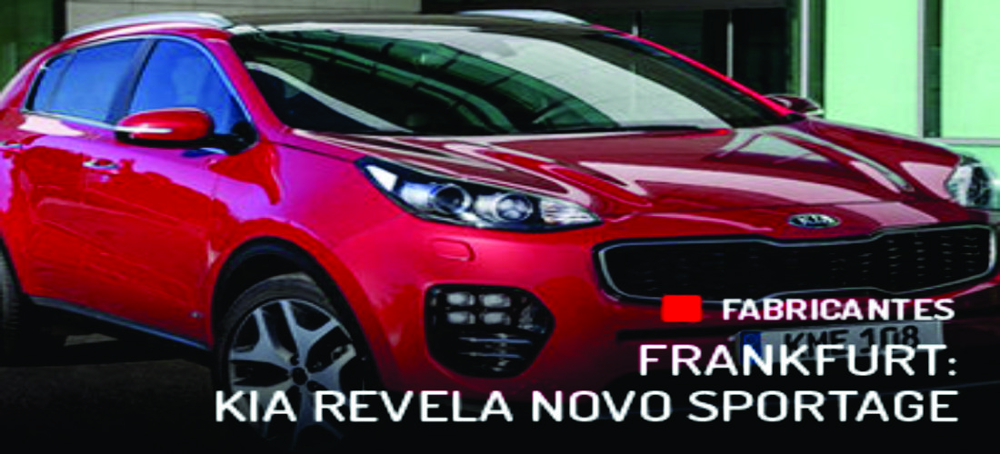
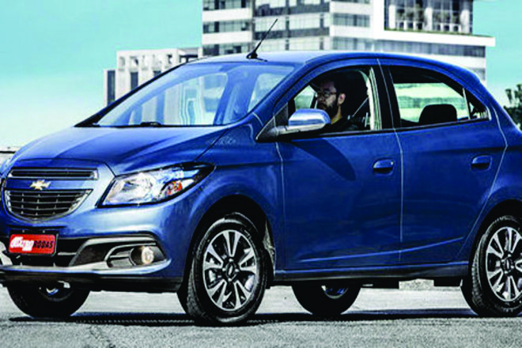
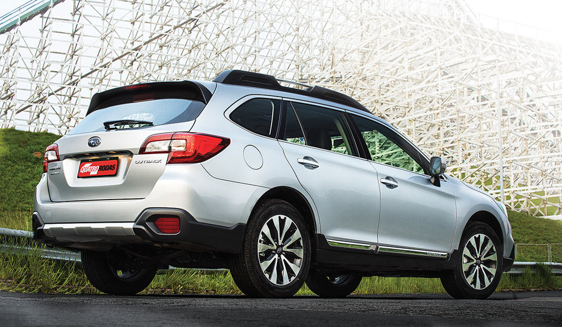
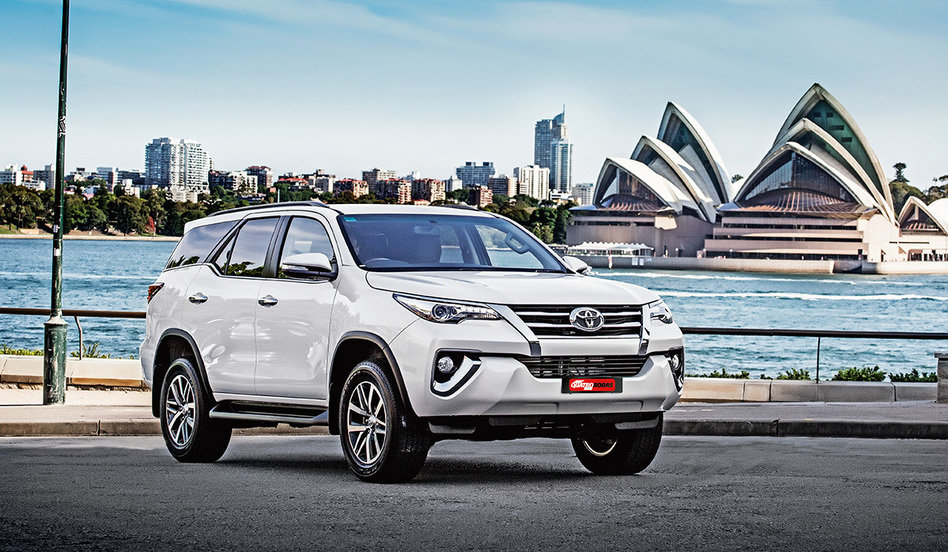

# teste2<!DOCTYPE html>
<html lang="pt-br">
  <head>
    <meta charset="utf-8">
    <meta http-equiv="X-UA-Compatible" content="IE=edge">
    <meta name="viewport" content="width=device-width, initial-scale=1">
    <title>Quatro Rodas</title>
    
    <link href='https://fonts.googleapis.com/css?family=Lato:400,900' rel='stylesheet' type='text/css'>
    <link href="css/bootstrap.min.css" rel="stylesheet">
    <link href="css/estilo.css" rel="stylesheet">
      
    <!--[if lt IE 9]>
      
      
    <![endif]-->
      
  </head>
 <body data-spy="scroll" data-target=".menu-navegacao" data-offset="80">
      <!-- Menu da aplicação -->
      <nav class="navbar navbar-default navbar-fixed-top">
        

            

                <button type="button" class="navbar-toggle" data-toggle="collapse" data-target="#menu-navegacao" >
                    
                    
                    
                </button>                
                <a class="navbar-brand" href="#page-top">Quatro Rodas</a>
            
  
            
            

                <ul class="nav navbar-nav navbar-right">
                    <li></li>
                    <li>
                        <a class="" href="#carros">Carros</a>
                    </li>
                    <li>
                        <a class="" href="#testes">Testes</a>
                    </li>
                    <li>
                        <a class="" href="#noticias">Noticias</a>
                    </li>
                    <li>
                        <a class="" href="#autoservicos">Auto Serviços</a>
                    </li>
                    <li>
                        <a class="" href="#guiadecompras">Guia de Compras</a>
                    </li>
                        <li>
                        <a class="" href="#tabelafipe">Tabela Fipe</a>
                    </li>
                    <li>
                        <a class="" href="#assine">Assine</a>
                    </li>
                </ul>
            

            
        

      </nav>
      <!-- // Menu da aplicação -->
      
      <!-- slider da aplicação -->
       

        

            

                

                    
                    <ol class="carousel-indicators">
                        <li data-target="#sliderprincipal" data-slide-to="0" class="active"></li>
                        <li data-target="#sliderprincipal" data-slide-to="1"></li>
                        <li data-target="#sliderprincipal" data-slide-to="2"></li>
                    </ol>
                    
                    

                        

                            
                        

                        

                            
                        

                        

                            
                        

                    
  
                    
                    <a class="left carousel-control" href="#sliderprincipal" role="button" data-slide="prev">
                        
                        Anterior
                    </a>
                    
                    <a class="right carousel-control" href="#sliderprincipal" role="button" data-slide="next">
                        
                        Próximo
                    </a>
                    
                

            

        

      
      
      <!-- // slider da aplicação -->
      
      <!-- Carros -->
     <section id="carros">
        

            

                

                    
<h1>Carros</h1>

                
                 
            
  
            

                
                

                    

                    <h4>CHEVROLET ONIX FECHA 2015 COMO O CARRO MAIS VENDIDO DO BRASIL</h4>
                    
Agora é oficial: o Onix foi o carro mais vendido no Brasil em 2015, trazendo a Chevrolet de volta ao topo do pódio após o longo hiato de 29 anos desde a vitória do Monza, em 1986. Com 125 931 unidades comercializadas, o compacto tomou de vez o posto dos líderes anteriores Fiat Palio (segundo colocado) e VW Gol (sexto colocado). Na liderança das vendas mensais desde agosto, o compacto apareceu, pela primeira vez, no topo do ranking dos mais vendidos no acumulado do ano apenas em novembro. 

                

                
                

                    

                    <h4>OS CAMPEÕES DE PROCURA NO GOOGLE EM 2015</h4>
                    
O Hyundai HB20 foi o modelo mais procurado no buscador do Google em 2015, segundo informações da empresa. Porém, no ranking de vendas da Fenabrave, o coreano ocupa a terceira posição. O caso mais curioso, no entanto, é o do Onix. Embora o Chevrolet seja o automóvel mais vendido do país, ocupa apenas o 10º lugar nas buscas feitas pelos usuários do site.
A lista de mais procurados é resultado de uma compilação de dados que, segundo o Google, representam trilhões de buscas feitas durante o ano

                

                
                

                    

                    <h4>IMPRESSÕES
ONIX: MELHOR EM NADA, BOM EM TUDO</h4>
                    
O Chevrolet Onix chegou à liderança de mercado pelo segundo mês consecutivo, segundo o ranking de emplacamentos da Fenabrave, firmando-se como o maior sucesso da General Motors nos últimos anos. Há mais de três décadas a marca não conquistava essa posição na lista de mais vendidos, mérito que havia sido conquistado pelo Monza, em 1984. Mas o que fez o hatch da GM ser tão querido assim?

                

                
            

            
            

                

                    <a href="#" class="btn btn-default btn-lg servicos_btn_todososcarros">Clique aqui para ver todos os nossos carros</a>
                

            

        

      </section>
      <!-- // carros -->
      
      <!-- testes -->
      <section id="testes" class="div_colorida">
        

            

                

                    
<h1>Testes </h1>

                
                
            

            

                

                    

                        

                      <h4>IMPRESSÕES
ONIX: MELHOR EM NADA, BOM EM TUDO</h4>
                    
O Chevrolet Onix chegou à liderança de mercado pelo segundo mês consecutivo, segundo o ranking de emplacamentos da Fenabrave, firmando-se como o maior sucesso da General Motors nos últimos anos. Há mais de três décadas a marca não conquistava essa posição na lista de mais vendidos, mérito que havia sido conquistado pelo Monza, em 1984. Mas o que fez o hatch da GM ser tão querido assim?

                    

                

                

                    

                        

                        <h4>IMPRESSÕES
ONIX: MELHOR EM NADA, BOM EM TUDO</h4>
                    
O Chevrolet Onix chegou à liderança de mercado pelo segundo mês consecutivo, segundo o ranking de emplacamentos da Fenabrave, firmando-se como o maior sucesso da General Motors nos últimos anos. Há mais de três décadas a marca não conquistava essa posição na lista de mais vendidos, mérito que havia sido conquistado pelo Monza, em 1984. Mas o que fez o hatch da GM ser tão querido assim?

                    

                

                 

                    

                        

                        <h4>IMPRESSÕES
ONIX: MELHOR EM NADA, BOM EM TUDO</h4>
                    
O Chevrolet Onix chegou à liderança de mercado pelo segundo mês consecutivo, segundo o ranking de emplacamentos da Fenabrave, firmando-se como o maior sucesso da General Motors nos últimos anos. Há mais de três décadas a marca não conquistava essa posição na lista de mais vendidos, mérito que havia sido conquistado pelo Monza, em 1984. Mas o que fez o hatch da GM ser tão querido assim?

                    

                

                
            
            

                

                    <a href="#" class="btn btn-default btn-lg">Clique aqui para conhecer todos os nossos clientes</a>
                

            

        

      </section>
      <!-- // testes -->
      
      <!-- noticias -->
      <section id="noticias" class="div_colorida">
        

            

                
<h1>Noticias</h1>

            
  
        

      </section>
      <!-- // noticias -->
      
      <!-- auto servicos -->
      <section id="autoservicos" class="div_colorida">
        

            

                
<h1>Autos Servicos</h1>

            
  
        

      </section>     
      <!-- //  auto servicos -->
      
      <!-- guia de compras -->
      <section id="guiadecompras"class="div_colorida">
        

            

                
<h1>Guia de Compras</h1>

            
  
        

      </section>   
      <!-- // guia de compras -->
 <!-- tabelafipe -->
      <section id="tabelafipe" class="div_colorida">
        

            

                
<h1>Tabela Fipe</h1>

            
  
        

      </section>     
      <!-- // Tabela fipe-->
 <!--assine -->
      <section id="assine"class="div_colorida">
        

            

                
<h1>Assine</h1>

            
  
        

      </section>  
      <!-- // assine-->
      
     
      
      
      
      
  </body>
</html>
